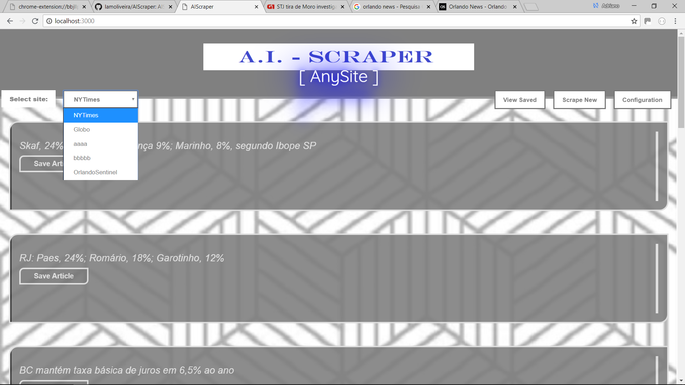
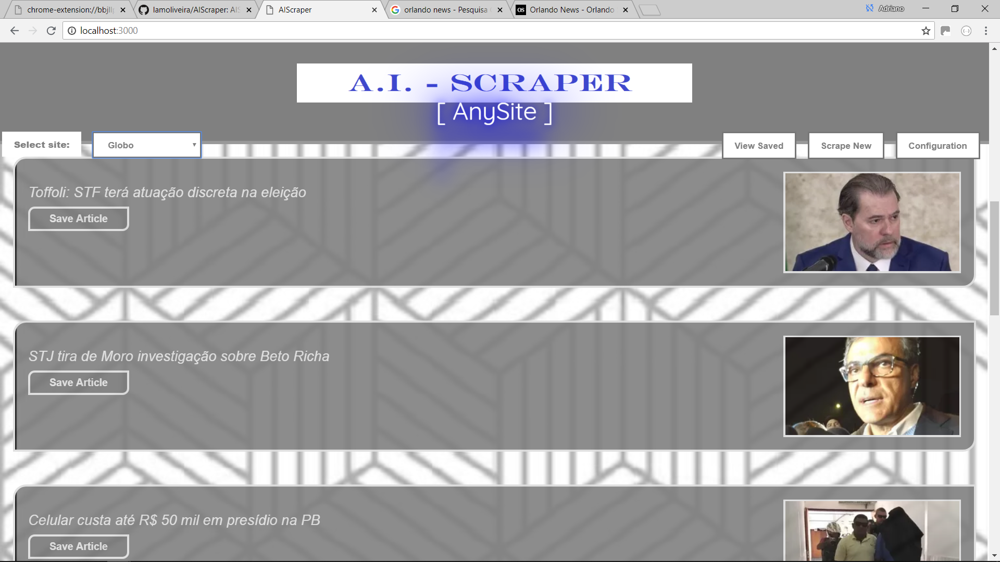
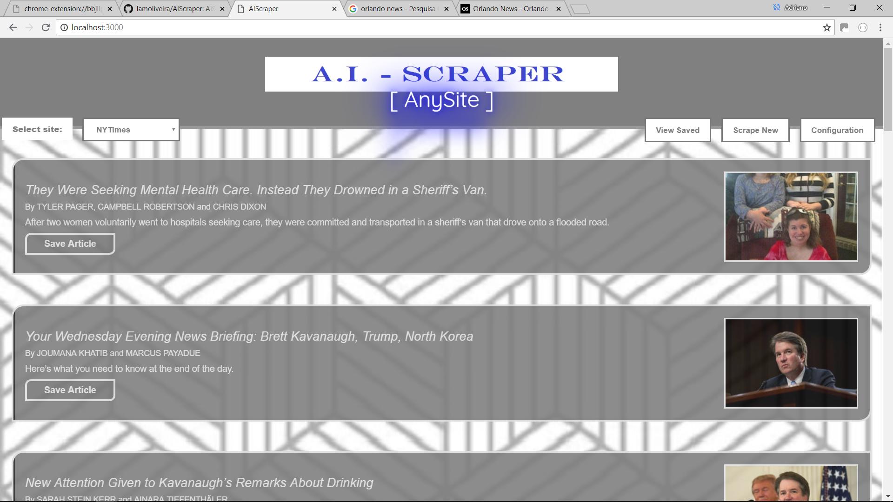
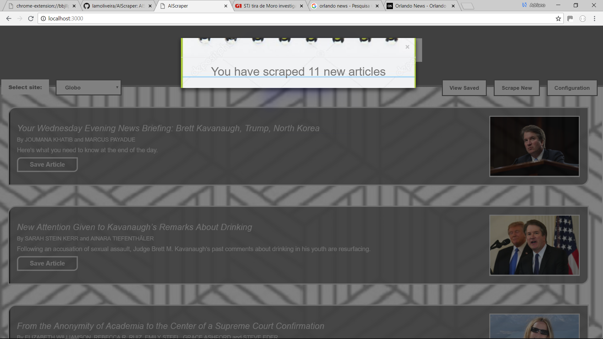
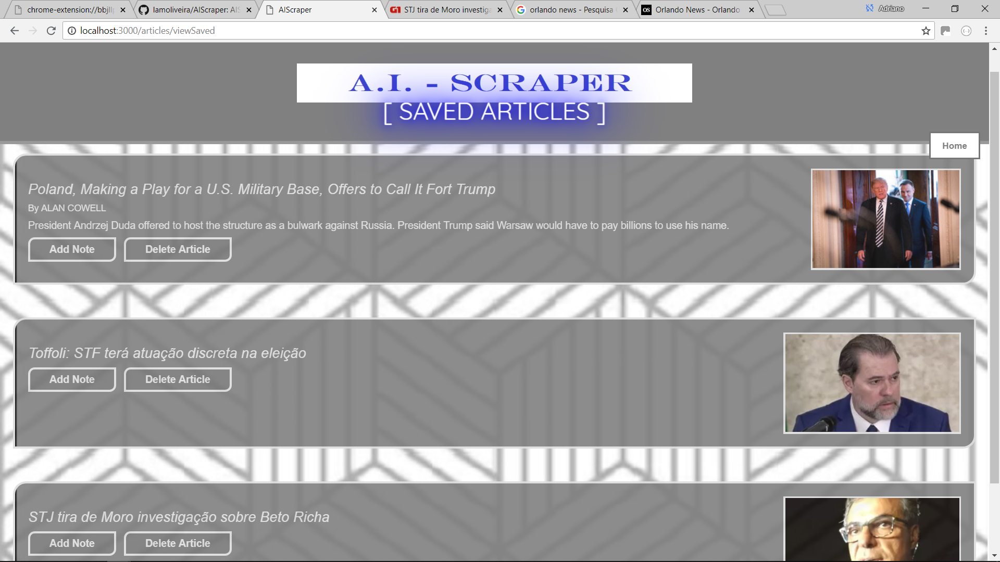
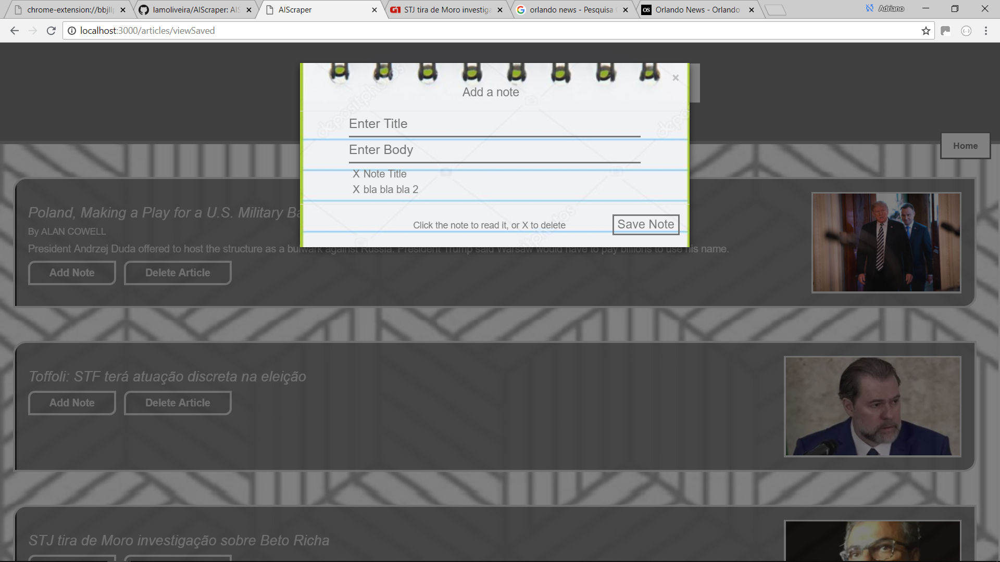
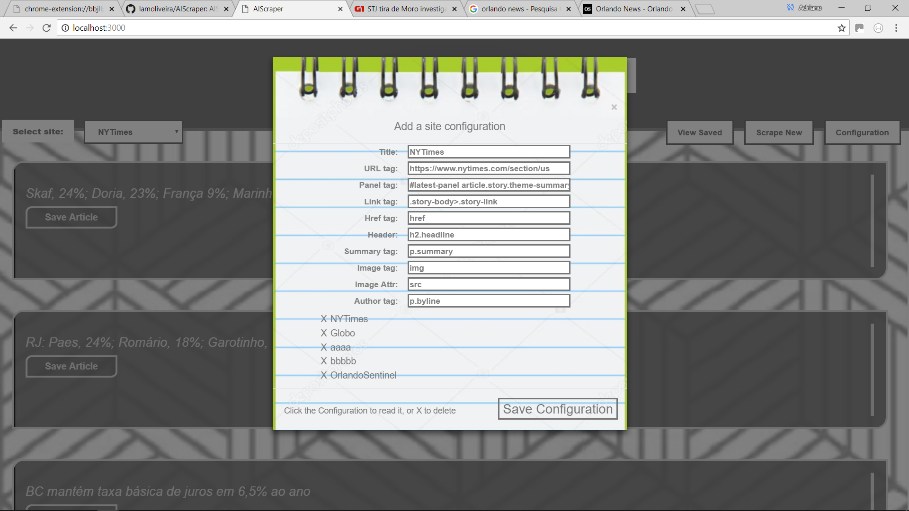
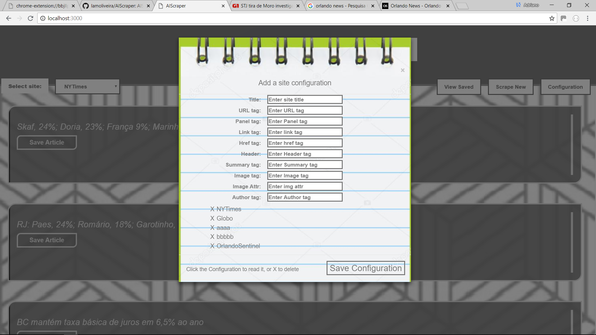

# **MongoDB/Mongoose ANY site web-scraper**

### To view the deployed version, _**[click here!](https://afternoon-escarpment-54838.herokuapp.com/)**_

## Technologies used:
* Node.js
* Express.js
* MongoDB
* Mongoose
* Handlebars.js
* Javascript/ES6
* jQuery
* AJAX/JSON
* NPM modules:
  * Cheerio
  * Request-Promise
* Bootstrap 3
* CSS3 (including css animations and transitions)
* HTML5

## choose using the dropbox wich site you want to scrape and click scrape new

## This is an app that uses Cheerio to scrape any site (the New York Times US section and Globo Brazil were parsed as an example) and pull the most recent articles, and it is possible to save each scraped article:
Sample site 1: Globo Brazil

Sample site 2: NYTimes USA

## Whenever the user chooses, they can scrape the newest articles that have been added for any site correctly configured: As a rehearsal it is not intended to parse errors, so it is necessary to use correctly the tags for a new site to retrieve the new articles...it is not a goal to try to be a site for real use due to a lack of errors verification, but it is possible to try and error changing the configuration and see the result of a scrape. Just follow the example of NYT and globo to see if you can scrape any other site.

## Users can click on the images or the title to take them to the corresponding site article, or click the 'Save Article' button to save the article:

## Once an article is saved, the user has the option to add their own notes to the articles, or to remove them:
  Users can type in a note title and body, and save notes specific to that article:
  If the user wishes to access the body of the note, they can click on the note and the form will be populated with the note body and title:
  The user can also delete notes that are no longer needed by clicking on the 'X':
  If the article is no longer of use, the user may delete it:

## Users can configure new sites to scrap:
  Use the examples of NYTimes to understand the logic of scrape and try on your own.

